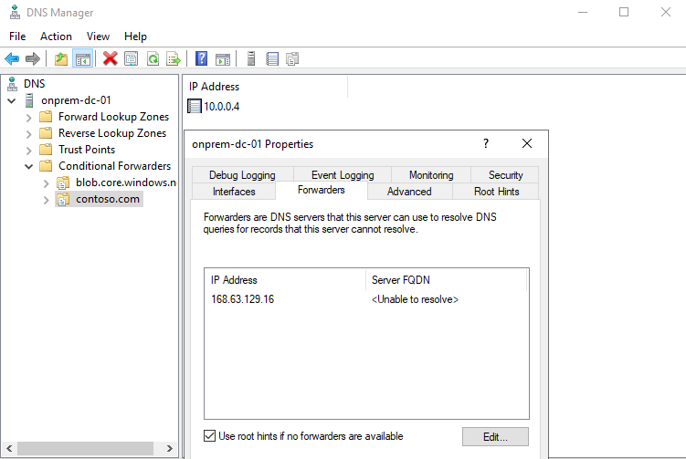
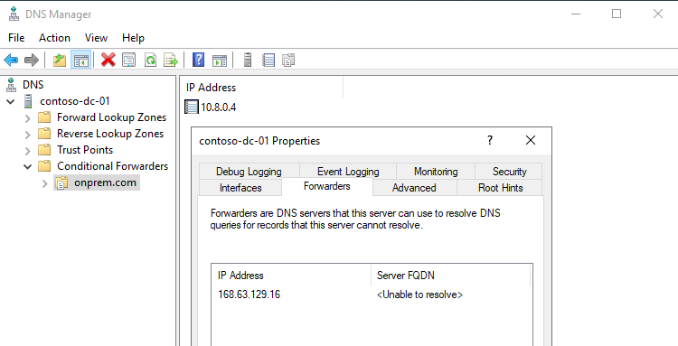

# Azure Virtual Machine with Active Directory forest Terraform Module

This terraform module is designed to deploy azure Windows 2012R2/2016/2019 virtual machines with Public IP, Availability Set and Network Security Group support. The original code has been duplicated to deploy two Virtual Networks with a VNet peering between them to simulate a hybrid environment (on-premises network connected to an Azure Virtual Network), for Azure DNS Private Resolver demonstration purposes.

This module also creates two Active Directory Forests using virtual machine extensions. However, this module only recommended for dev/test/demo environments. For production use of this module, fortify the security by adding correct NSG rules and security architecture.

Active Directory must be supported by DNS to function properly, and Microsoft recommend that to install DNS when creates an Active Directory Domain. This modules also install DNS and integrate with active directory as there are some advantages of utilizing Active Directory integrated DNS as DNS zone. The primary benefits is AD replication will take care of DNS zone replication automatically and second one All DNS servers are writable. This reduces the necessity to configure and allot for separate DNS zone transfer traffic. Other benefits include secure updates and DHCP integration.

> Active Directory must have DNS to function properly, but the implementation of Active Directory Services does not require the installation of Microsoft DNS. A BIND DNS or other third-party DNS will fully support a Windows domain. **However third party DNS server is not yet supported by this module.**

In addition to the resources deployed by the original code, the following resources are deployed:

- Subnets for Inbound and Outbound endpodint for Azure DNS Private Resolver, and an additional subnet for Private Endpoints.
- Each Virtual Network is configured with the Domain Controller IP Address as Custom DNS.
- Azure Private DNS resource, this includes Inbound Endpoint, Outbound Endpoint, a Rule Set with some DNS Rules and a link to the Virtual Network that simulates the Azure part of the hybrid environment.
- An Azure Private DNS Zone for `privatelink.blob.core.windows.net` to test internal resolution of Storage Accounts.
- A Storage Account with a private endpoint to test internal resolution of Storage Accounts.

For additional information on Azure DNS Private Zones and Azure DNS Private Resolver and how they work together, please refer to the following documents:

- [What is Azure Private DNS?](https://learn.microsoft.com/en-us/azure/dns/private-dns-overview)
- [What is Azure DNS Private Resolver?](https://learn.microsoft.com/en-us/azure/dns/dns-private-resolver-overview)

The resulting code has been tested with just one virtual machine in each part of the hybrid environment (on-premises/azure). For issues on deploying more than one VM as part of the Availability Set, please refer to the original repository.

The resulting code has not been run as a module, but directly using the main.tf file ib conjuntion with a variables.tfvars file.

## Code Usage

To run the code just run

```hcl
terraform init
```

To review the resources to be deployed run

```hcl
terraform plan -var-file=variables.tfvars
```

To effectively deploy the resources run

```hcl
terraform apply -var-file=variables.tfvars
```

For additional information on the module features please refer to the original repository

## DNS Configuration

Once deployed, DNS resolution is configured as follows:

- A VM on each network (simulated on-premises/azure) is a Domain Controller with DNS service. This DNS is configured as Custom DNS on each VNet.
- Both DNS servers have a Server Forwarder to 168.63.129.16. This is required in the Azure network to use the Private DNS Zone and Private DNS Resolver, and in the simulated on-premises network for the extension to be installed succesfully.
- Each DNS server has a conditional forwarder to the other Domain Controller so we initially have hybrid resolution.
- The on-premises DNS server has a conditional forwarder for `blob.core.windows.net` with the Azure DNS server address.
- The Azure DNS Private Resolver has forwarding rules for `onprem.com` and `contoso.com`.

The below images show this configuration:

On-premises DNS server:


Azure DNS server


## DNS Tests

With a simple `nslookup` command you can test that DNS resolution is working using the DNS service on the VMs, or by using the Azure DNS Private Resolver service:

### Resolution from on-premises

```code
C:\>hostname
onprem-dc-01

C:\>nslookup
DNS request timed out.
    timeout was 2 seconds.
Default Server:  UnKnown
Address:  ::1

> contoso.com
Server:  localhost
Address:  127.0.0.1

Non-authoritative answer:
Name:    contoso.com
Address:  10.0.0.4

> contosostg01.blob.core.windows.net
Server:  localhost
Address:  127.0.0.1

Non-authoritative answer:
Name:    contosostg01.privatelink.blob.core.windows.net
Address:  10.0.199.4
Aliases:  contosostg01.blob.core.windows.net
```

### Resolution from on-premises using the Private DNS Resolver

```code
C:\>hostname
onprem-dc-01

C:\>nslookup
DNS request timed out.
    timeout was 2 seconds.
Default Server:  UnKnown
Address:  ::1

> server 10.0.254.4
DNS request timed out.
    timeout was 2 seconds.
Default Server:  [10.0.254.4]
Address:  10.0.254.4

> contoso.com
Server:  [10.0.254.4]
Address:  10.0.254.4

Non-authoritative answer:
Name:    contoso.com
Address:  10.0.0.4

> contosostg01.blob.core.windows.net
Server:  [10.0.254.4]
Address:  10.0.254.4

Non-authoritative answer:
Name:    contosostg01.privatelink.blob.core.windows.net
Address:  10.0.199.4
Aliases:  contosostg01.blob.core.windows.ne
```

### Resolution from Azure

```code
C:\>hostname
contoso-dc-01

C:\>nslookup
Default Server:  UnKnown
Address:  ::1

> onprem.com
Server:  UnKnown
Address:  ::1

Non-authoritative answer:
Name:    onprem.com
Address:  10.8.0.4

> contosostg01.blob.core.windows.net
Server:  UnKnown
Address:  ::1

Non-authoritative answer:
Name:    contosostg01.privatelink.blob.core.windows.net
Address:  10.0.199.4
Aliases:  contosostg01.blob.core.windows.net
```

### Resolution from Azure using the Private DNS Resolver

```code
C:\>hostname
contoso-dc-01

C:\Users\dnunezmo>nslookup
Default Server:  UnKnown
Address:  ::1

> server 10.0.254.4
Default Server:  [10.0.254.4]
Address:  10.0.254.4

> onprem.com
Server:  [10.0.254.4]
Address:  10.0.254.4

Non-authoritative answer:
Name:    onprem.com
Address:  10.8.0.4

> onprem-dc-01.onprem.com
Server:  [10.0.254.4]
Address:  10.0.254.4

Non-authoritative answer:
Name:    onprem-dc-01.onprem.com
Address:  10.8.0.4
```

## Authors

Originally created by [Kumaraswamy Vithanala](mailto:kumarvna@gmail.com)

This fork by [Diego Nuñez](mailto:dnunezmo@hotmail.com)

## Other resources

- [Windows Virtual Machine](https://docs.microsoft.com/en-us/azure/virtual-machines/windows/)
- [Active Directory Setup](https://cloudblogs.microsoft.com/industry-blog/en-gb/technetuk/2016/06/08/setting-up-active-directory-via-powershell/)
- [Terraform AzureRM Provider Documentation](https://www.terraform.io/docs/providers/azurerm/index.html)
- [Azure DNS documentation](https://learn.microsoft.com/en-us/azure/dns/)
